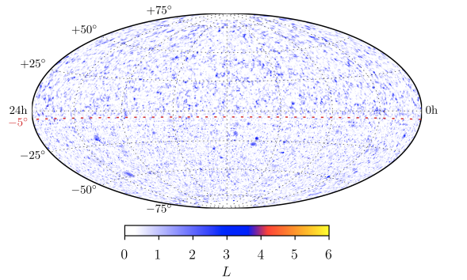

---
analysis_profile:
  category: pdf
  field: "Astroparticle physics"
  reason: "An explicit unbinned sky likelihood models signal and background. Scrambling or trials corrections calibrate significance, not the forward density."
  note: "Approximate analysis-scale values; costs depend on the workload and implementation."
  metrics:
    forward_model_core_hours: 0.00001
    parameter_count: 2
    analysis_core_hours: 0.3
    data_input_mb: 2400
    external_frameworks: 1
    software_stack_lines: 50000
    citation_count: 10
---

# IceCube · Source correlations

Combine public neutrino events and detector response with source catalogues in a sky likelihood.

!!! info "Reproduction status"

    **Scoped**. Independent validation pending. Status updated 2026-07-17.

## Scientific model

This case concerns analytic convolution: a sky-scan test-statistic/local-$p$-value map and the hottest-source significance from the public point-source data.

The reproduction objective below defines the current scope; a complete published-analysis reproduction is not asserted.

## Model ingredients

Reusing this model requires the ingredients below. Availability and limitations
are described in the reproduction evidence.

- Neutrino event sample or skymap
- source catalogues and selection
- source spectrum, unbinned sky likelihood or correlation statistic
- trial-factor treatment and data-release provenance.

## Reproduction objective and evidence

**Objective:** Sky-scan test-statistic/local-$p$-value map and hottest-source significance from the public point-source data

**Scope and limitations:** The intended 2008–2018 data release is identified. The sky-scan likelihood reproduction remains to be implemented.

## Figures

*Reference figure from the publication cited below.*

## Publications

- **Bellenghi:2023icecube** (2023) · [DOI: 10.3847/2041-8213/ad0203](https://doi.org/10.3847/2041-8213/ad0203) · [arXiv:2309.03115](https://arxiv.org/abs/2309.03115)

[Back to model gallery](../index.md)
