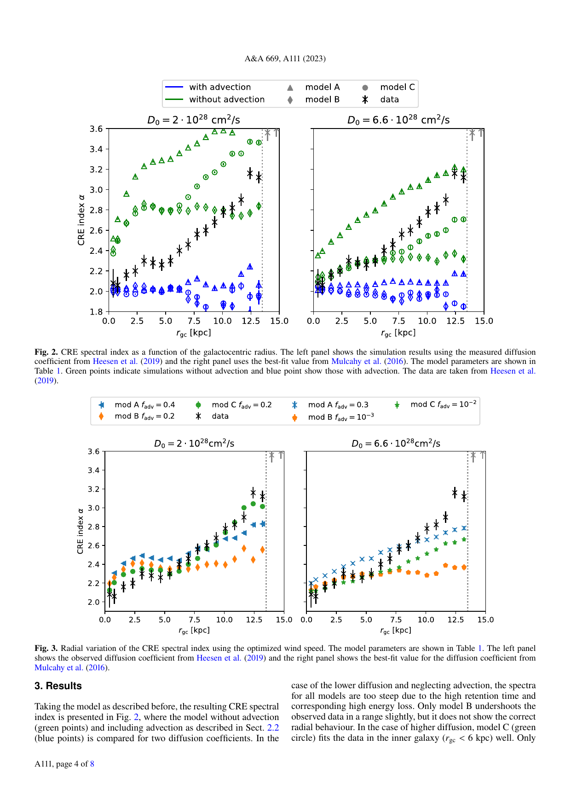

---
analysis_profile:
  category: mc
  field: "Astroparticle physics"
  reason: "Predictions rely on Monte Carlo cosmic-ray electron transport before deriving the radial spectral index."
  note: "Approximate analysis-scale values; costs depend on the workload and implementation."
  metrics:
    forward_model_core_hours: 1000
    parameter_count: 5
    analysis_core_hours: 100000
    data_input_mb: 1
    external_frameworks: 6
    software_stack_lines: 10000
    citation_count: 10
---

# M51 · cosmic-ray electron transport

Relate diffusion, magnetic fields and electron transport to spatially resolved radio observations.

!!! info "Reproduction status"

    **Scoped**. Independent validation pending. Status updated 2026-07-17.

## Scientific model

This case concerns mc density estimation. CRE spectral index vs radius for two diffusion coefficients at reduced statistics

The reproduction objective below defines the current scope; a complete published-analysis reproduction is not asserted.

## Model ingredients

Reusing this model requires the ingredients below. Availability and limitations
are described in the reproduction evidence.

- Transport equation and source distribution
- diffusion/advection assumptions
- magnetic-field model and synchrotron-emission calculation
- fitted parameters and observational maps or spectra.

## Reproduction objective and evidence

**Objective:** CRE spectral index vs radius for two diffusion coefficients at reduced statistics

**Scope and limitations:** The legacy CRPropa branch is available, but paper steering files and spatial maps are still needed.

## Figures

*Reference figure from the publication cited below.*

## Publications

- **2023AA:669A.111D** (2023) · [DOI: 10.1051/0004-6361/202244331](https://doi.org/10.1051/0004-6361/202244331) · [arXiv:2206.11670](https://arxiv.org/abs/2206.11670)

[Back to model gallery](../index.md)
