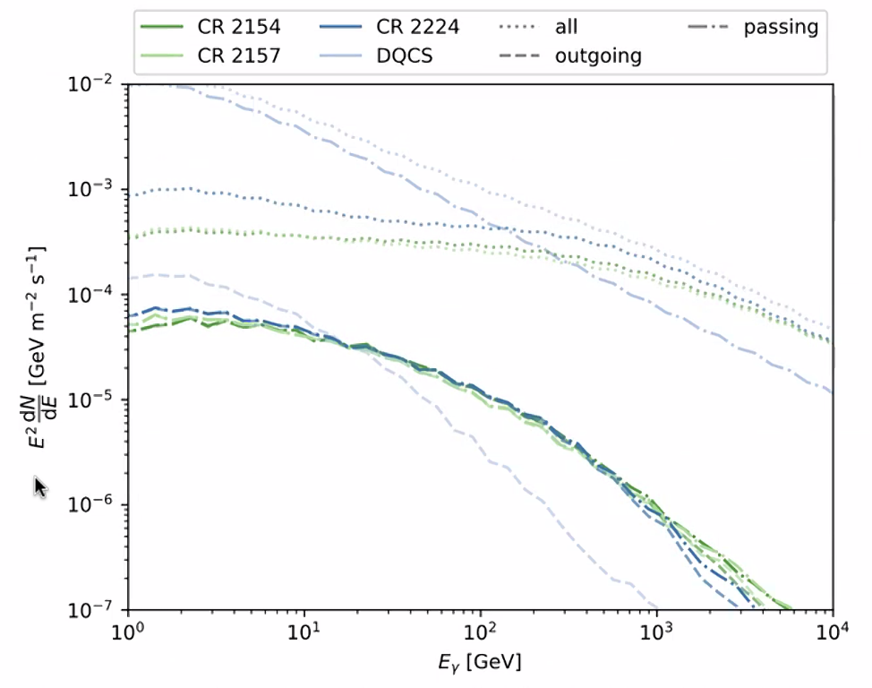

---
analysis_profile:
  category: mc
  field: "Astroparticle physics"
  reason: "Photon predictions require Monte Carlo cosmic-ray transport and interactions in the solar environment; the required plugin is not public."
  note: "Approximate analysis-scale values; costs depend on the workload and implementation."
  metrics:
    forward_model_core_hours: 6500
    parameter_count: 2
    analysis_core_hours: 100000
    data_input_mb: 100
    external_frameworks: 366
    software_stack_lines: 10000
    citation_count: 3
    data_output_gb: 120
    RAM_requirement_gb: 50
---

# Solar magnetic-field $\gamma$-ray production

Study how magnetic-field configurations change the spectrum and production locations of solar $\gamma$ rays.

!!! info "Reproduction status"

    **Blocked**. Independent validation pending. Status updated 2026-07-17.

## Scientific model

This case concerns mc density estimation. Disk gamma-ray spectra for different solar magnetic-field configurations at reduced statistics

The reproduction objective below defines the current scope; a complete published-analysis reproduction is not asserted.

## Model ingredients

Reusing this model requires the ingredients below. Availability and limitations
are described in the reproduction evidence.

- Propagation method
- analytical magnetic field and evaluation grid
- target-density and hadronic cross-section tables
- observer and simulation boundaries
- source particle species, spectra, positions and emission configuration.

## Reproduction objective and evidence

**Objective:** Disk $\gamma$-ray spectra for different solar magnetic-field configurations at reduced statistics

**Scope and limitations:** Reproduction is blocked on a required CRPropa solar plugin that is not yet public.

## Figures

*Reference figure from the publication cited below.*

## Publications

- **Dorner:2025ait** (2026) · [DOI: 10.3847/1538-4357/ae5e5f](https://doi.org/10.3847/1538-4357/ae5e5f) · [arXiv:2512.01403](https://arxiv.org/abs/2512.01403)

[Back to model gallery](../index.md)
