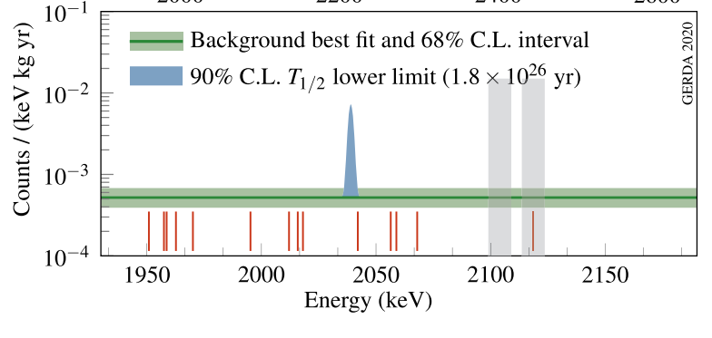

---
analysis_profile:
  category: pdf
  field: "Low-background physics"
  reason: "The target is an explicit extended signal-plus-background likelihood. Access to the original final likelihood remains incomplete."
  note: "Approximate analysis-scale values; costs depend on the workload and implementation."
  metrics:
    forward_model_core_hours: 0.01
    parameter_count: 10
    analysis_core_hours: 1
    data_input_mb: 1
    external_frameworks: 1
    software_stack_lines: 1000
    citation_count: 100
---

# GERDA · $0\nu\beta\beta$ search

Describe the signal peak, exposure, backgrounds and uncertainty model behind a half-life limit.

!!! info "Reproduction status"

    **Scoped**. Independent validation pending. Status updated 2026-07-17.

## Scientific model

This case concerns analytic convolution: a 90% CL lower limit on $T_{1/2}^{0\nu}$ and the $Q_{\beta\beta}$-region spectrum with fitted background.

The reproduction objective below defines the current scope; a complete published-analysis reproduction is not asserted.

## Model ingredients

Reusing this model requires the ingredients below. Availability and limitations
are described in the reproduction evidence.

- Isotope and exposure
- energy estimator and region of interest
- background and signal-peak models
- efficiency, resolution, nuisance parameters and likelihood or posterior
- half-life parameterization and external inputs for mass interpretations.

## Reproduction objective and evidence

**Objective:** 90% CL lower limit on $T_{1/2}^{0\nu}$ and the $Q_{\beta\beta}$-region spectrum with fitted background

**Scope and limitations:** A machine-readable final likelihood or event release has not been located. A surrogate would need to be identified separately.

## Figures

*Reference figure from the publication cited below.*

## Publications

- **GERDA:2020xhi** (2020) · [DOI: 10.1103/PhysRevLett.125.252502](https://doi.org/10.1103/PhysRevLett.125.252502) · [arXiv:2009.06079](https://arxiv.org/abs/2009.06079)
- **Ettengruber:2022mtm** (2022) · [DOI: 10.1103/PhysRevD.106.073004](https://doi.org/10.1103/PhysRevD.106.073004) · [arXiv:2208.09954](https://arxiv.org/abs/2208.09954)

[Back to model gallery](../index.md)
