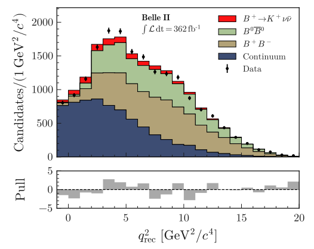

---
analysis_profile:
  category: pdf
  field: "Flavor anomalies"
  reason: "The released binned likelihood provides explicit count probabilities and nuisance constraints; templates can be reweighted."
  note: "Approximate analysis-scale values; costs depend on the workload and implementation."
  metrics:
    forward_model_core_hours: 0.1
    parameter_count: 300
    analysis_core_hours: 10
    data_input_mb: 1
    external_frameworks: 3
    software_stack_lines: 5000
    citation_count: 300
---

# Belle II · $B^+\to K^+\nu\bar\nu$

A released likelihood and response tables open a route from the rare $B^+\to K^+\nu\bar\nu$ decay measurement to alternative theoretical predictions.

!!! info "Reproduction status"

    **In progress**. Independent validation pending. Status updated 2026-07-17.

## Scientific model

Reweight the signal kinematics, apply the released response and combine signal and background templates.

Fit the signal strength, then repeat for a reweighted theoretical model.

## Model ingredients

Reusing this model requires the ingredients below. Availability and limitations
are described in the reproduction evidence.

- Tagging categories, fitted observables and binning
- signal response and kinematic reweighting
- background templates, normalizations, nuisance constraints and correlations
- mapping to the released binned likelihood.

## Reproduction objective and evidence

**Objective:** Signal-strength profile-likelihood scan from the released likelihood, plus one worked reinterpretation

**Scope and limitations:** Public likelihood and response resources have been identified. The reproduction has not yet completed the Standard Model fit and reweighted reinterpretation.

## Public release

The [HEPData reinterpretation release](https://www.hepdata.net/record/ins2947386) is the primary provenance link for the likelihood and its response resources.

## Figures

*Reference figure from the publication cited below.*

## Publications

- **Belle-II:2023esi** (2024) · [DOI: 10.1103/PhysRevD.109.112006](https://doi.org/10.1103/PhysRevD.109.112006) · [arXiv:2311.14647](https://arxiv.org/abs/2311.14647)
- **Belle-II:2025knunu** (2025) · [arXiv:2507.12393](https://arxiv.org/abs/2507.12393)

[Back to model gallery](../index.md)
