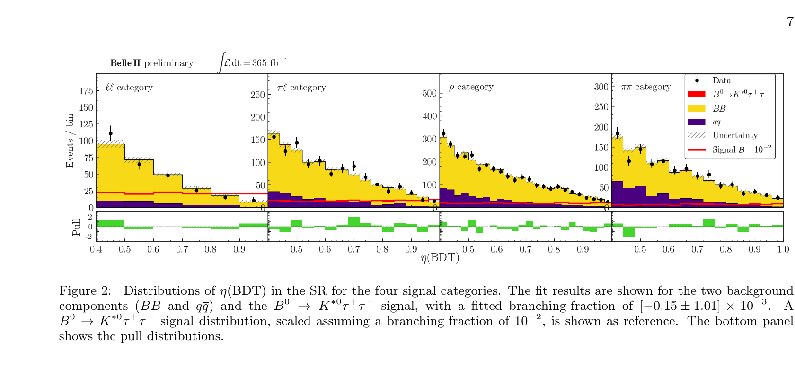

---
analysis_profile:
  category: pdf
  field: "Flavor anomalies"
  reason: "The released pyhf workspace defines a binned probability model. Toy experiments calibrate limits rather than define the forward prediction."
  note: "Approximate analysis-scale values; costs depend on the workload and implementation."
  metrics:
    forward_model_core_hours: 0.1
    parameter_count: 100
    analysis_core_hours: 10
    data_input_mb: 1
    external_frameworks: 2
    software_stack_lines: 5000
    citation_count: 10
---

# Belle II · $B^0\to K^{*0}\tau^+\tau^-$

Use the released binned likelihood to investigate an upper limit on the $B^0\to K^{*0}\tau^+\tau^-$ branching fraction.

!!! info "Reproduction status"

    **In progress**. Independent validation pending. Status updated 2026-07-17.

## Scientific model

This case concerns bin lookup. Observed/expected 90% CL upper limit on the branching fraction from the released pyhf workspace

The reproduction objective below defines the current scope; a complete published-analysis reproduction is not asserted.

## Model ingredients

Reusing this model requires the ingredients below. Availability and limitations
are described in the reproduction evidence.

- Hadronic-tagging categories and τ decay modes
- classifier-output bins
- signal and background templates
- nuisance parameters and the profile-likelihood limit-setting procedure.

## Reproduction objective and evidence

**Objective:** Observed/expected 90% CL upper limit on the branching fraction from the released pyhf workspace

**Scope and limitations:** Preliminary numerical fits use the released pyhf likelihood. A completed likelihood scan and validated limit reproduction are not yet available.

## Public release

A [released pyhf likelihood on HEPData](https://www.hepdata.net/record/ins2911582).

## Figures

*Reference figure from the publication cited below.*

## Publications

- **Belle-II:2025ktautau** (2025) · [DOI: 10.1103/v1q3-9dy8](https://doi.org/10.1103/v1q3-9dy8) · [arXiv:2504.10042](https://arxiv.org/abs/2504.10042)

[Back to model gallery](../index.md)
