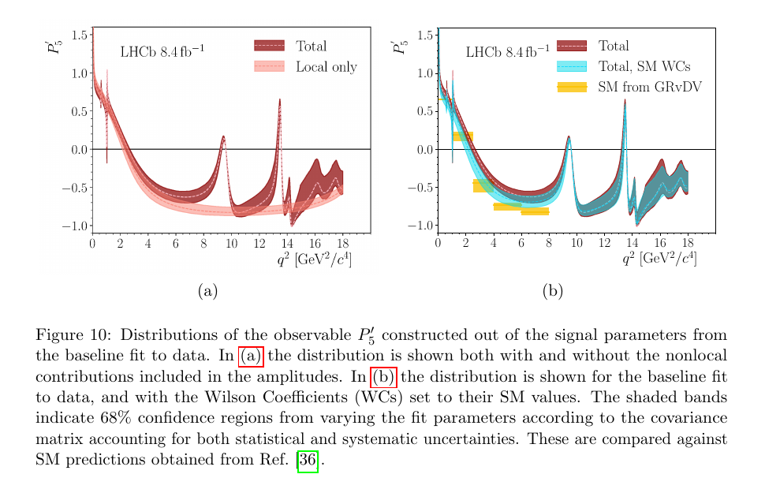

---
analysis_profile:
  category: measure
  field: "Flavor anomalies"
  reason: "The scoped interface evaluates pointwise signal intensity; acceptance and normalization needed for a pdf are outside this interface."
  note: "Approximate analysis-scale values; costs depend on the workload and implementation."
  metrics:
    forward_model_core_hours: 0.1
    parameter_count: 100
    analysis_core_hours: 100
    data_input_mb: 100
    external_frameworks: 3
    software_stack_lines: 10000
    citation_count: 10
---

# LHCb · $B^0\to K^{*0}\mu^+\mu^-$ amplitudes

Preserve amplitude conventions and theoretical inputs for a precision flavor measurement.

!!! info "Reproduction status"

    **In progress**. Independent validation pending. Status updated 2026-07-15.

## Scientific model

This case concerns closed-form amplitude. Pointwise physical signal intensity as the forward path; Figure 10(a) P5-prime interval as the analysis target

The reproduction objective below defines the current scope; a complete published-analysis reproduction is not asserted.

## Model ingredients

Reusing this model requires the ingredients below. Availability and limitations
are described in the reproduction evidence.

- Angular conventions and $q^2$ dependence
- local and nonlocal amplitude components
- resonance inputs and form factors
- Wilson coefficients, nuisance constraints, covariance matrices and alternative theoretical descriptions.

## Reproduction objective and evidence

**Objective:** Pointwise physical signal intensity as the forward path; Figure 10(a) $P_5^\prime$ interval as the analysis target

**Scope and limitations:** The current scope is the pointwise signal intensity. Acceptance, resolution, normalization and the full likelihood are excluded; validation inputs remain incomplete.

## Figures

*Reference figure from the publication cited below.*

## Publications

- **LHCb:2024onj** (2024) · [DOI: 10.1007/JHEP09(2024)026](https://doi.org/10.1007/JHEP09(2024)026) · [arXiv:2405.17347](https://arxiv.org/abs/2405.17347)

[Back to model gallery](../index.md)
