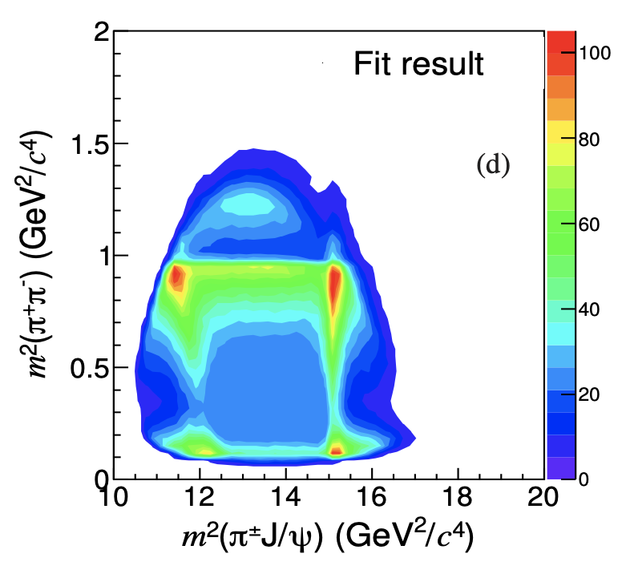

---
analysis_profile:
  category: measure
  field: "Hadron spectroscopy"
  reason: "Resonance amplitudes and mass-spectrum intensities supply the forward prediction; normalization and detector response are separate."
  note: "Approximate analysis-scale values; costs depend on the workload and implementation."
  metrics:
    forward_model_core_hours: 0.1
    parameter_count: 100
    analysis_core_hours: 1
    data_input_mb: 100
    external_frameworks: 2
    software_stack_lines: 1000
    citation_count: 1000
---

# BESIII · $Z_c(3900)$ in $e^+e^-\to\pi\pi J/\psi$

Reconstruct a charged charmoniumlike mass spectrum through signal, background and resolution models.

!!! info "Reproduction status"

    **Scoped**. Independent validation pending. Status updated 2026-07-17.

## Scientific model

This case concerns a closed-form amplitude. Refit the $M(\pi J/\psi)$ spectrum to recover the published $Z_c(3900)$ mass and width.

The reproduction objective below defines the current scope; a complete published-analysis reproduction is not asserted.

## Model ingredients

Reusing this model requires the ingredients below. Availability and limitations
are described in the reproduction evidence.

- Production at $\sqrt{s}=4.26\,\mathrm{GeV}$ and the $J/\psi$ decay channel
- invariant-mass variables
- signal and background parameterizations
- spin-parity hypotheses where used
- detector resolution, fit parameters and external inputs.

## Reproduction objective and evidence

**Objective:** Refit of the $M(\pi J/\psi)$ spectrum recovering the published $Z_c(3900)$ mass and width

**Scope and limitations:** The published spectrum needs digitization before the proposed forward-model and fit checks.

## Figures

*Reference figure from the publication cited below.*

## Publications

- **BESIII:2013ris** (2013) · [DOI: 10.1103/PhysRevLett.110.252001](https://doi.org/10.1103/PhysRevLett.110.252001) · [arXiv:1303.5949](https://arxiv.org/abs/1303.5949)

[Back to model gallery](../index.md)
