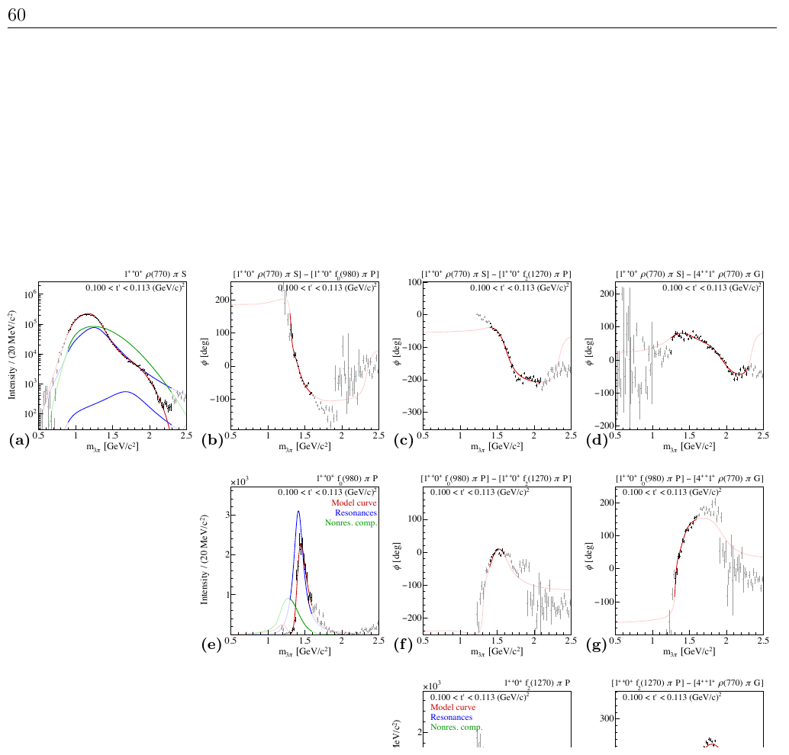

---
analysis_profile:
  category: measure
  field: "Hadron spectroscopy"
  reason: "Partial-wave amplitudes and intensities require acceptance and normalization information before forming a probability model."
  note: "Approximate analysis-scale values; costs depend on the workload and implementation."
  metrics:
    forward_model_core_hours: 0.1
    parameter_count: 1000
    analysis_core_hours: 1000
    data_input_mb: 1000
    external_frameworks: 2
    software_stack_lines: 10000
    citation_count: 100
---

# COMPASS · $\pi p\to3\pi p$ partial waves

Public complex amplitudes and covariance matrices provide inputs for a reduced resonance-model reconstruction of $\pi p\to3\pi p$.

!!! info "Reproduction status"

    **Scoped**. Independent validation pending. Status updated 2026-07-17.

## Scientific model

This case concerns closed-form amplitude. Resonance-model curves on published wave intensities and phases for a reduced wave subset

The reproduction objective below defines the current scope; a complete published-analysis reproduction is not asserted.

## Model ingredients

Reusing this model requires the ingredients below. Availability and limitations
are described in the reproduction evidence.

- Beam and target process
- mass and momentum-transfer bins
- partial waves, reflectivity and spin conventions
- isobar parameterizations and rank assumptions
- acceptance corrections, spin-density matrices and systematic wave-set variations.

## Reproduction objective and evidence

**Objective:** Resonance-model curves on published wave intensities and phases for a reduced wave subset

**Scope and limitations:** The reduced forward-model reproduction is still to be built.

## Figures

*Reference figure from the publication cited below.*

## Publications

- **COMPASS:2018uzl** (2018) · [DOI: 10.1103/PhysRevD.98.092003](https://doi.org/10.1103/PhysRevD.98.092003) · [arXiv:1802.05913](https://arxiv.org/abs/1802.05913)
- **COMPASS:2015gxz** (2017) · [DOI: 10.1103/PhysRevD.95.032004](https://doi.org/10.1103/PhysRevD.95.032004) · [arXiv:1509.00992](https://arxiv.org/abs/1509.00992)

[Back to model gallery](../index.md)
