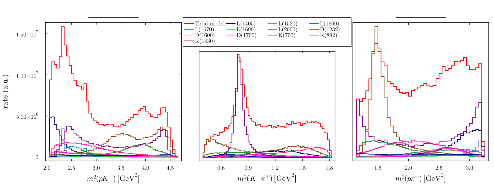
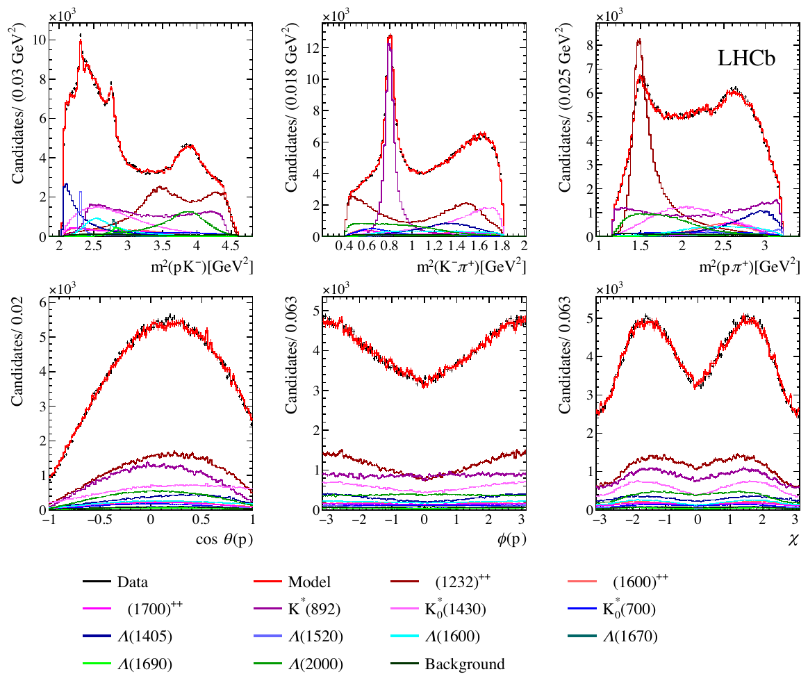

---
analysis_profile:
  category: measure
  field: Hadron spectroscopy
  reason: The released helicity amplitudes define an unnormalized intensity; phase-space integration supplies the normalization.
  note: Forward cost measured for 400,000 events on one core after warm-up. Analysis cost estimates 1,000 forward passes; other metrics are approximate.
  metrics:
    forward_model_core_hours: 0.025
    parameter_count: 100
    analysis_core_hours: 25
    data_input_mb: 10
    external_frameworks: 2
    software_stack_lines: 10000
    citation_count: 10
---

# LHCb · $\Lambda_c^+\to p K^- \pi^+$
Follow the coherent sum of resonance amplitudes that describes a charm baryon decay, from model components to mass projections.

!!! info "Reproduction status"

    **Reported reproduction**. Independent validation pending. Status updated 2026-07-14.

## Scientific model

Combine helicity decay chains, lineshapes and complex couplings into an intensity, then project it over three-body phase space.

The published analysis fits the amplitude model and polarization. The current reproduction evaluates and projects the released forward model only.

## Model ingredients

Reusing this model requires the ingredients below. Availability and limitations
are described in the reproduction evidence.

- Particle identities and ordering
- decay topology and Dalitz variables
- helicity and spin conventions
- resonance lineshapes and form factors
- complex couplings and fit fractions
- efficiency and background descriptions
- covariance information and alternative amplitude models.

## Reproduction objective and evidence

**Objective:** Figure 3 projection of the released $\Lambda_c^+\to p K^- \pi^+$ helicity-amplitude forward model

**Scope and limitations:** The forward model is reproduced; the original data and simulated-event tuples are unavailable. This does not reproduce the likelihood fit, detector acceptance or parameter uncertainties. Independent audit pending.

## Released model and reported checks

The [released Julia implementation](https://github.com/mmikhasenko/Lc2ppiKSemileptonicModelLHCb.jl/tree/99860344a18dfabd51c0c2b69933308861ccc4e6)
uses ThreeBodyDecays.jl. The reported checks used version 0.7.0, commit
`99860344a18dfabd51c0c2b69933308861ccc4e6`, with Julia 1.11.5.

The default model has 26 decay chains. It combines sequential helicity vertices,
resonance lineshapes and complex couplings; Wigner rotations align spin states
before coherent summation. Spin sums or density-matrix contractions give the intensity.

At the reference point

```text
m²(Kπ) = 0.7980703453578917 GeV²
m²(πp) = 3.6486261122281745 GeV²
(2λp, 2λπ, 2λK; 2hΛc) = (1, 0, 0; 1)
```

the reported intensity is `9345.853380852272` and helicity amplitude
`-45.132326950250516 + 54.85942516648609i`. The reported upstream test run passed 24 assertions.

The Figure 3 comparison generates model projections over the Dalitz plane. The
coherent total and individual resonance components are the target; the black
publication data points are not regenerated. Tested alternative amplitude models
are part of what needs preserving, together with the default model.

A reported 400,000-event, single-thread benchmark took about 0.025 core-hours after
warm-up. The approximately 25 core-hour full-analysis figure is an estimate of
1,000 forward passes, not a measured fit.

To inspect and test the pinned public implementation:

```bash
git clone https://github.com/mmikhasenko/Lc2ppiKSemileptonicModelLHCb.jl
cd Lc2ppiKSemileptonicModelLHCb.jl
git checkout 99860344a18dfabd51c0c2b69933308861ccc4e6
julia --project=. -e 'using Pkg; Pkg.instantiate(); Pkg.test()'
```

The companion [polarimeter study](https://arxiv.org/abs/2301.07010) uses this
amplitude model. A future encoding with reusable decay blocks should retain the
reference-point tests and make phase, particle-ordering and spin conventions explicit.

## Figures



*Reproduced model prediction or comparison with published results.*



*Reference figure from the publication cited below.*

## Publications

- **Amplitude analysis of the $\Lambda_c^+\to p K^- \pi^+$ decay and $\Lambda_c^+$ baryon polarization measurement in semileptonic beauty hadron decays** (2023) · [DOI: 10.1103/PhysRevD.108.012023](https://doi.org/10.1103/PhysRevD.108.012023) · [arXiv:2208.03262](https://arxiv.org/abs/2208.03262)

[Back to Hadron spectroscopy and amplitude analysis](index.md)
