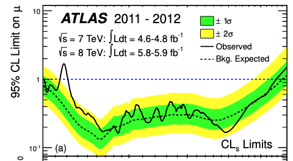

---
analysis_profile:
  category: pdf
  field: "Higgs/collider likelihoods"
  reason: "The target is a combined channel likelihood with explicit probability terms. The original discovery workspace is not publicly available."
  note: "Approximate analysis-scale values; costs depend on the workload and implementation."
  metrics:
    forward_model_core_hours: 0.1
    parameter_count: 100
    analysis_core_hours: 1000
    data_input_mb: 1000
    external_frameworks: 3
    software_stack_lines: 10000
    citation_count: 10000
---

# ATLAS · Higgs discovery, 2012

A historical case study of the channels and correlated uncertainties behind the Higgs-boson discovery.

!!! info "Reproduction status"

    **Blocked**. Independent validation pending. Status updated 2026-07-17.

## Scientific model

This case concerns bin lookup: the $CL_s$ 95% limit and local $p_0$ as functions of $m_H$ from simplified reconstructed channel likelihoods ($\gamma\gamma$, $4\ell$, and $WW$).

The reproduction objective below defines the current scope; a complete published-analysis reproduction is not asserted.

## Model ingredients

Reusing this model requires the ingredients below. Availability and limitations
are described in the reproduction evidence.

- Channel and process definitions
- observables, mass hypotheses and signal strength
- nuisance parameters and correlations
- asymptotic or ensemble significance procedure
- provenance of any reconstructed likelihood.

## Reproduction objective and evidence

**Objective:** $CL_s$ 95% limit and local $p_0$ as functions of $m_H$ from simplified reconstructed channel likelihoods ($\gamma\gamma$, $4\ell$, and $WW$)

**Scope and limitations:** The original channel data and statistical models needed for the discovery combination have not been released.

## Figures

*Reference figure from the publication cited below.*

## Publications

- **ATLAS:2012yve** (2012) · [DOI: 10.1016/j.physletb.2012.08.020](https://doi.org/10.1016/j.physletb.2012.08.020) · [arXiv:1207.7214](https://arxiv.org/abs/1207.7214)
- **ATLAS:2012oga** (2012) · [DOI: 10.1126/science.1232005](https://doi.org/10.1126/science.1232005)

[Back to model gallery](../index.md)
