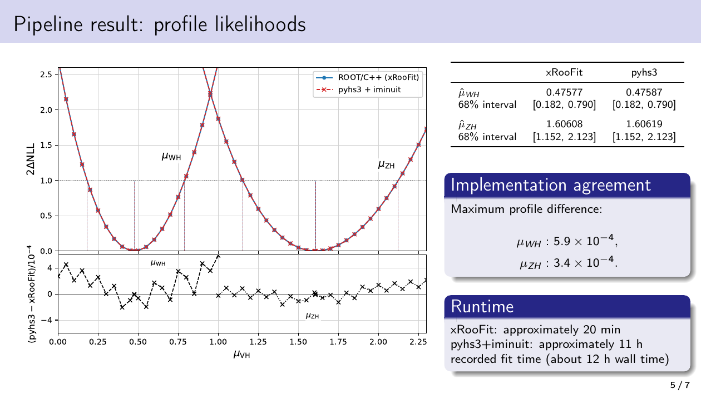
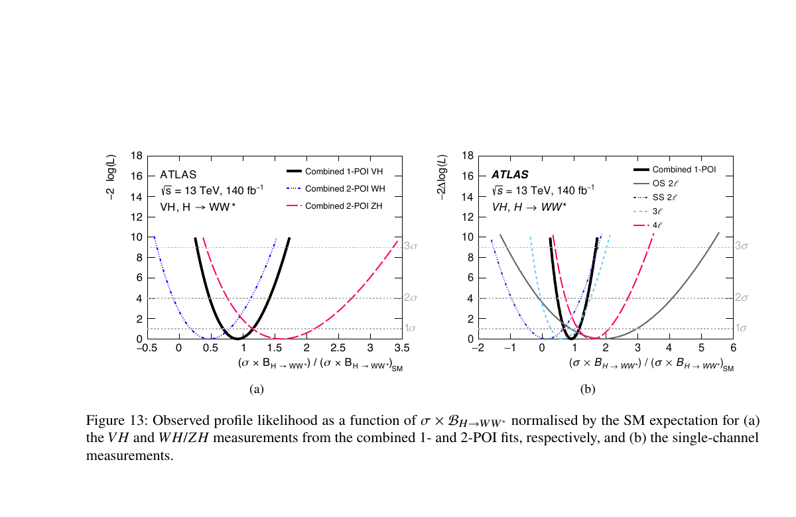
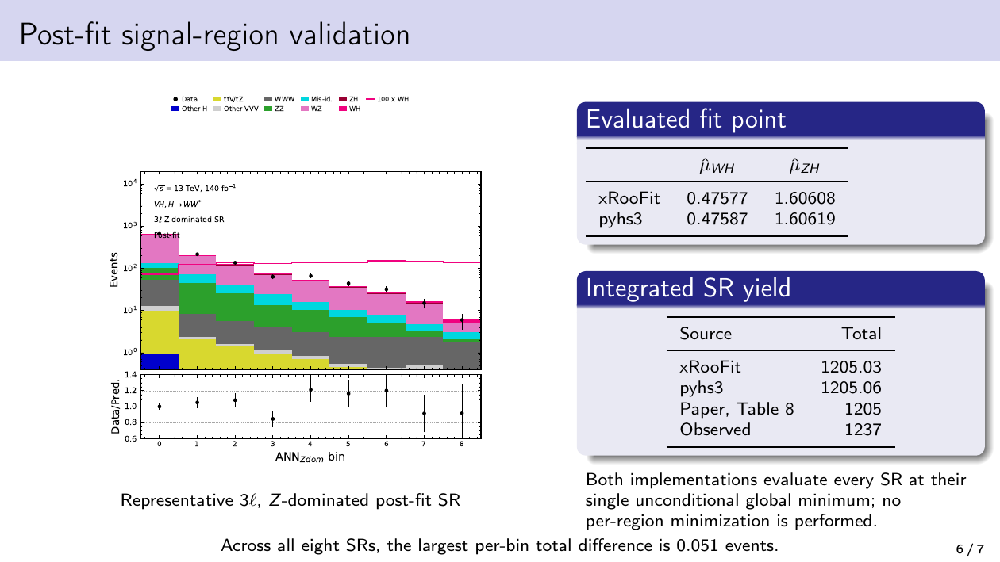

---
analysis_profile:
  category: pdf
  field: "Collider likelihoods"
  reason: "The HS3 workspace specifies Poisson channel probabilities and auxiliary constraints, evaluated directly by likelihood engines."
  note: "Approximate analysis-scale values; costs depend on the workload and implementation."
  metrics:
    forward_model_core_hours: 0.1
    parameter_count: 495
    analysis_core_hours: 0.33
    data_input_mb: 10
    external_frameworks: 2
    software_stack_lines: 1000
    citation_count: 10
---

# ATLAS · $VH$, $H\to WW^*$ likelihood

Explore how one serialized likelihood connects 14 analysis channels and reproduces the $WH$ and $ZH$ signal strengths in two independent implementations.

!!! info "Reproduction status"

    **Reported reproduction**. Independent validation pending. Status updated 2026-07-17.

## Scientific model

Signal and background templates are modified by systematic parameters and summed into expected counts. Poisson terms and auxiliary constraints form the combined likelihood.

Profile the $WH$ and $ZH$ signal strengths with ROOT/xRooFit and pyhs3 + iminuit, and compare fitted yields and confidence intervals.

## Model ingredients

Reusing this model requires the ingredients below. Availability and limitations
are described in the reproduction evidence.

- Channels and histograms
- systematic modifiers, normalizations, nuisance constraints and correlations
- signal-strength parameters
- validation points and source-release identity.

## Reproduction objective and evidence

**Objective:** Two-POI profile likelihood and post-fit yields from the public $VH$, $H\to WW^*$ HS3 workspace

**Scope and limitations:** The reported comparison shows agreement between both engines and the publication. An independent audit is pending, and the executable workflow scripts are not yet archived. The local HS3 artifact is a repository copy; byte identity with the original HEPData download has not been established.

## Concrete reproduction target

The concrete target is associated $WH$ and $ZH$ production with $H\to WW^*$, using a 14-channel model and two signal-strength parameters. The reproduction report describes fits with ROOT/xRooFit and pyhs3 + iminuit and agreement with eight published signal-region yields after rounding. The [HEPData release](https://www.hepdata.net/record/157861) is the publication-side provenance link. This workspace represents this measurement; it does not reproduce the historical Higgs discovery combination.

## Figures

*Reproduced model prediction or comparison with published results.*

*Reference figure from the publication cited below.*

*Reproduced model prediction or comparison with published results.*

## Model artifact

The downloadable artifact is an HS3 0.2 workspace (1,720,710 bytes).

- Source revision: `e1812a7663c9773632e12fca71dd0b1f5d499ecf`
- Source path: `src/physics/high-energy/hww/HWW.hs3.json`
- SHA-256: `d8d856feb009be361144251ace762b154a1836100e27215a7d0bb50c759687e8`

[Download the HS³ workspace](../../assets/gallery/atlas-public-likelihoods/HWW.hs3.json)

## Publications

- **ATLAS:2025abg** (2025) · [DOI: 10.1007/JHEP08(2025)034](https://doi.org/10.1007/JHEP08(2025)034) · [arXiv:2503.19420](https://arxiv.org/abs/2503.19420)

[Back to model gallery](../index.md)
