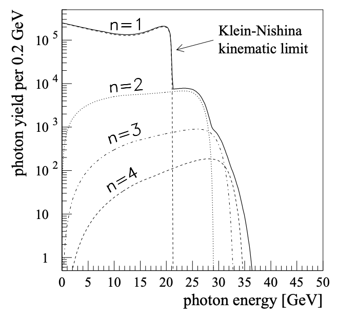

---
analysis_profile:
  category: mc
  field: "Laser and warm dense matter"
  reason: "The proposed Ptarmigan route estimates photon distributions through Monte Carlo electron-laser event simulation."
  note: "Approximate analysis-scale values; costs depend on the workload and implementation."
  metrics:
    forward_model_core_hours: 1
    parameter_count: 10
    analysis_core_hours: 100
    data_input_mb: 10
    external_frameworks: 2
    software_stack_lines: 1000
    citation_count: 100
---

# E144 · Nonlinear QED

Model photon spectra from high-energy electron–laser collisions and compare nonlinear QED predictions.

!!! info "Reproduction status"

    **In progress**. Independent validation pending. Status updated 2026-07-15.

## Scientific model

This case concerns mc density estimation. Convolved nonlinear-Compton photon spectrum with n=1,2,3,4 harmonics; measured electron spectrum as detector-level extension

The reproduction objective below defines the current scope; a complete published-analysis reproduction is not asserted.

## Model ingredients

Reusing this model requires the ingredients below. Availability and limitations
are described in the reproduction evidence.

- Electron-beam and laser parameters
- intensity parameter and kinematic variables
- differential rates and strong-field QED approximations
- detector acceptance, Monte Carlo implementation and benchmark distributions.

## Reproduction objective and evidence

**Objective:** Convolved nonlinear-Compton photon spectrum with $n=1,2,3,4$ harmonics; measured electron spectrum as detector-level extension

**Scope and limitations:** A Ptarmigan-based forward calculation has been proposed. Its simulation results and the validity of its approximations for this measurement have not yet been established.

## Figures

*Reference figure from the publication cited below.*

## Publications

- **Bamber:1999zt** (1999) · [DOI: 10.1103/PhysRevD.60.092004](https://doi.org/10.1103/PhysRevD.60.092004)

[Back to model gallery](../index.md)
