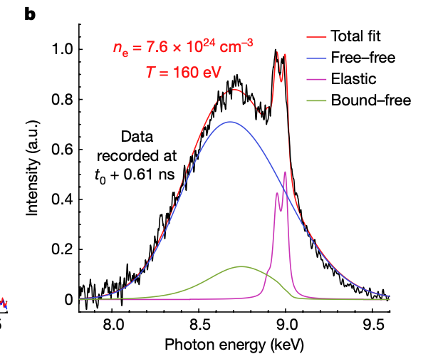

---
analysis_profile:
  category: measure
  field: "Warm dense matter"
  reason: "The forward calculation yields a dynamic structure factor or response spectrum convolved with instrument response, rather than a normalized event pdf."
  note: "Approximate analysis-scale values; costs depend on the workload and implementation."
  metrics:
    forward_model_core_hours: 100
    parameter_count: 100
    analysis_core_hours: 1000
    data_input_mb: 1000
    external_frameworks: 3
    software_stack_lines: 10000
    citation_count: 100
---

# Warm dense matter · X-ray scattering

Trace how a dynamic structure factor and instrumental response turn the properties of warm dense matter into an X-ray spectrum.

!!! info "Reproduction status"

    **In progress**. Independent validation pending. Status updated 2026-07-15.

## Scientific model

Calculate the spectral response of the plasma and convolve it with the instrument function.

Compare or fit the predicted spectrum to the published X-ray scattering measurements.

## Model ingredients

Reusing this model requires the ingredients below. Availability and limitations
are described in the reproduction evidence.

- Thermodynamic state
- ion/electron response
- Chihara or non-Chihara decomposition
- simulation method and structure-factor tables
- instrument convolution, uncertainty model and derived-dataset provenance.

## Reproduction objective and evidence

**Objective:** XRTS spectrum: dynamic-structure-factor model with components over the measured spectrum

**Scope and limitations:** A proposed reproduction uses a JaXRTS route; the separate WDM repository uses xDAVE. Their assumptions and relation to the original calculation still need expert alignment.

## Figures

*Reference figure from the publication cited below.*

## Publications

- **doeppner2023observing** (2023)
- **dornheim2024unraveling** (2024)
- **baczewski2016x** (2016)

[Back to model gallery](../index.md)
