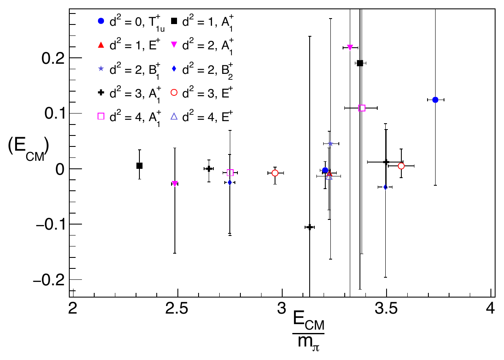

---
analysis_profile:
  category: measure
  field: "Lattice QCD"
  reason: "The solver supplies amplitudes, levels and phase shifts, not a normalized probability model. A separate observation model relates predicted and measured levels."
  note: "Approximate analysis-scale values; costs depend on the workload and implementation."
  metrics:
    forward_model_core_hours: 1
    parameter_count: 10
    analysis_core_hours: 100
    data_input_mb: 10
    external_frameworks: 2
    software_stack_lines: 1000
    citation_count: 100
---

# Finite-volume spectra to $K$-matrix amplitudes

Connect finite-volume energy levels to infinite-volume scattering through a quantization condition.

!!! info "Reproduction status"

    **In progress**. Independent validation pending. Status updated 2026-07-17.

## Scientific model

This case concerns integral-equation solve. Box-matrix Δ diagnostic (Fig. 1) and phase-shift fit through the paper's finite-volume levels

The reproduction objective below defines the current scope; a complete published-analysis reproduction is not asserted.

## Model ingredients

Reusing this model requires the ingredients below. Availability and limitations
are described in the reproduction evidence.

- Finite-volume energies and covariance
- lattice irreducible representations, particle masses and spacing
- quantization condition
- $K$-matrix and channel definitions
- priors or constraints and numerical solver version.

## Reproduction objective and evidence

**Objective:** Box-matrix $\Delta$ diagnostic (Fig. 1) and phase-shift fit through the paper's finite-volume levels

**Scope and limitations:** A reduced forward calculation works. The paper-specific energy levels and phase-shift fit inputs remain to be recovered.

## Figures

*Reference figure from the publication cited below.*

## Publications

- **Morningstar:2017spu** (2017) · [DOI: 10.1016/j.nuclphysb.2017.09.014](https://doi.org/10.1016/j.nuclphysb.2017.09.014) · [arXiv:1707.05817](https://arxiv.org/abs/1707.05817)

[Back to model gallery](../index.md)
