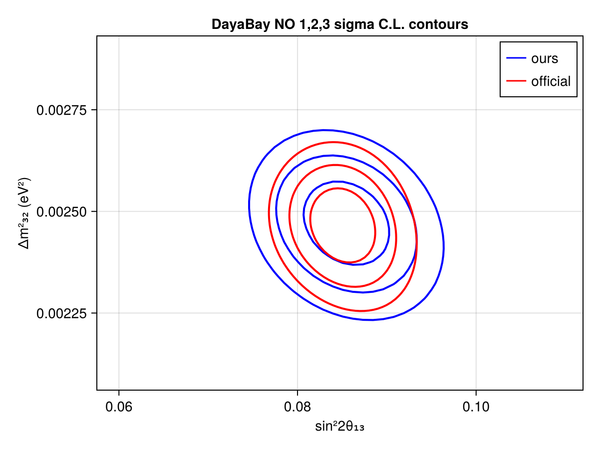
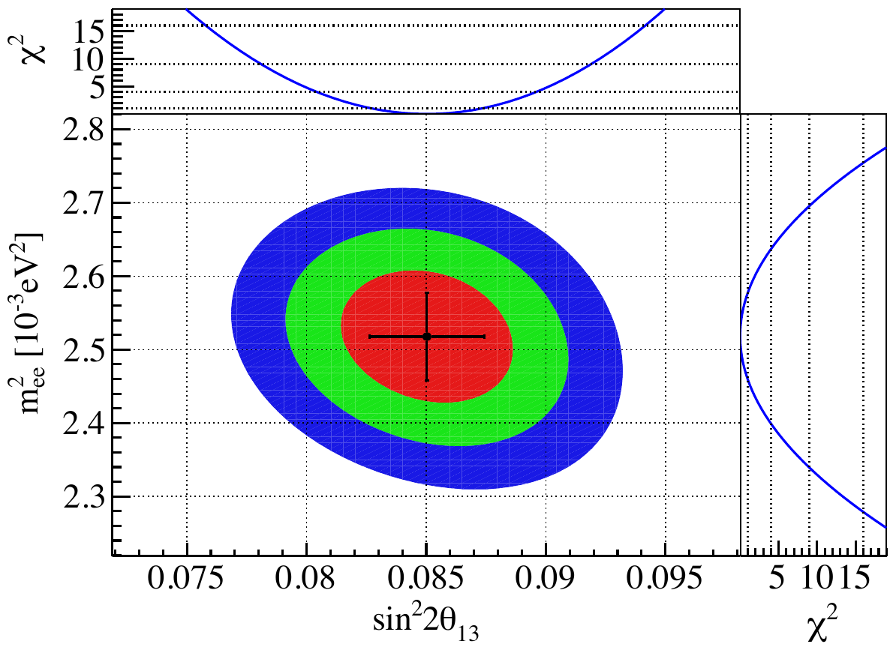

---
analysis_profile:
  category: pdf
  field: "Neutrino oscillations"
  reason: "Analytically folded spectra enter an explicit covariance-based likelihood; parameter scanning does not require fresh event simulation."
  note: "Profile estimates are retained for comparison. The reported 3158-day benchmark differs; costs depend on scan size and whether setup is included."
  metrics:
    forward_model_core_hours: 0.000004
    parameter_count: 6
    analysis_core_hours: 0.006
    data_input_mb: 1
    external_frameworks: 1
    software_stack_lines: 16000
    citation_count: 143
---

# Daya Bay · reactor $\bar\nu_e$ disappearance

Connect reactor spectra, oscillation probabilities and detector response to a measurement of the neutrino mixing parameters.

!!! info "Reproduction status"

    **Reported reproduction**. Independent validation pending. Status updated 2026-07-14.

## Scientific model

Fold reactor flux with oscillation probabilities, interaction cross sections and detector response to predict prompt-energy spectra.

Scan two oscillation parameters with a covariance-based likelihood using the Newtrinos.jl implementation.

## Model ingredients

Reusing this model requires the ingredients below. Availability and limitations
are described in the reproduction evidence.

- Reactor fluxes and baselines
- oscillation probability and interaction cross sections
- detector response, prompt-energy spectra and backgrounds
- nuisance treatment and covariance matrices.

## Reproduction objective and evidence

**Objective:** $1\sigma$, $2\sigma$, and $3\sigma$ contours in $(\sin^2 2\theta_{13},\Delta m^2_{32})$ overlaid on the official 3158-day $\Delta\chi^2$ surface

**Scope and limitations:** The reported best fit agrees closely with the publication, but reproduced contours are about 10% wider. The report discusses the covariance treatment. Independent audit pending.

## Which dataset is reproduced?

The historical publication below is the 2012 observation. The reported contour comparison instead targets the [3158-day measurement, arXiv:2211.14988](https://arxiv.org/abs/2211.14988), using Newtrinos.jl commit `ad55e3bb71a903d0cdd2a2391c10c410cb0e0d20`. The reproduction report describes a two-dimensional grid scan with covariance-based systematics; other parameters remain fixed. Agreement with this release is not a rerun of the 2012 analysis.

## Figures

*Reproduced model prediction or comparison with published results.*

*Reference figure from the publication cited below.*

## Publications

- **DayaBay:2012fng** (2012) · [DOI: 10.1103/PhysRevLett.108.171803](https://doi.org/10.1103/PhysRevLett.108.171803) · [arXiv:1203.1669](https://arxiv.org/abs/1203.1669)

[Back to model gallery](../index.md)
