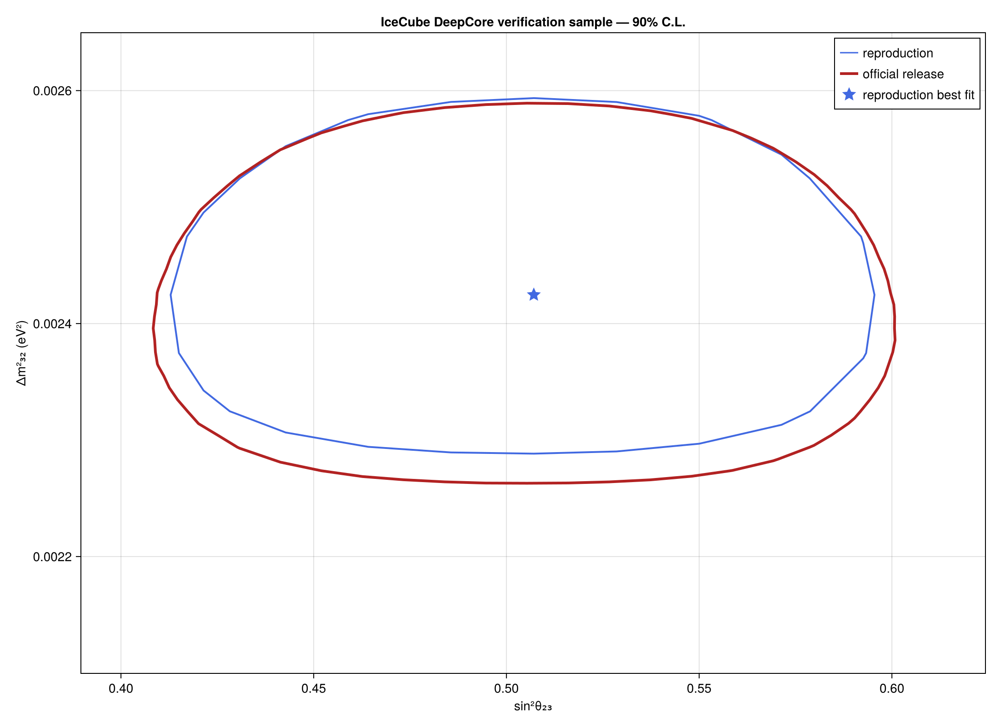
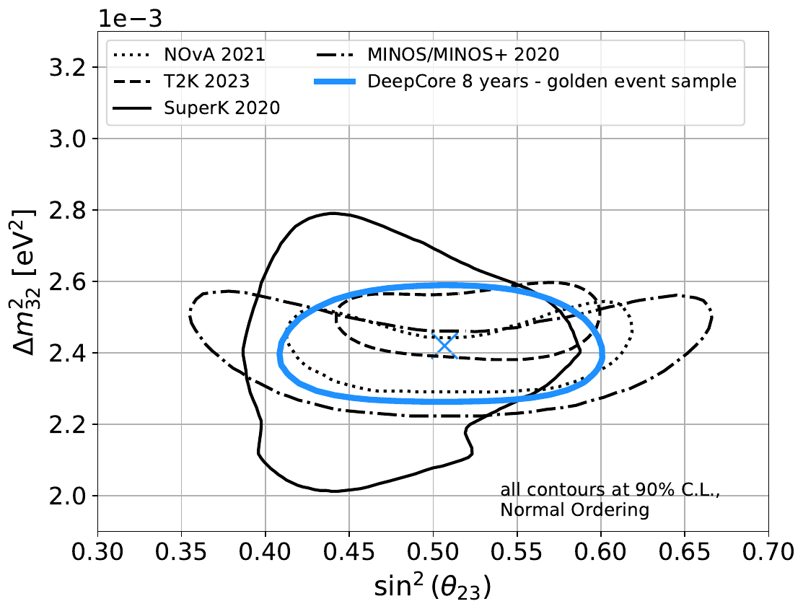

---
analysis_profile:
  category: pdf
  field: "Neutrino oscillations"
  reason: "The verification-sample analysis evaluates an explicit likelihood with detector-response information. Simulation-derived inputs do not make this a simulator-only interface."
  note: "Approximate costs for the scoped oscillation analysis; release, sample and profiling settings affect runtime."
  metrics:
    forward_model_core_hours: 0.000005
    parameter_count: 21
    analysis_core_hours: 7.5
    data_input_mb: 60
    external_frameworks: 1
    software_stack_lines: 16000
    citation_count: 44
---

# IceCube · DeepCore

Explore the chain from atmospheric neutrino flux to detector counts and a two-parameter oscillation contour.

!!! info "Reproduction status"

    **Reported reproduction**. Independent validation pending. Status updated 2026-07-14.

## Scientific model

Propagate atmospheric neutrinos through an oscillation and detector-response calculation to predict reconstructed event distributions.

Scan two oscillation parameters while profiling 15 others in Newtrinos.jl.

## Model ingredients

Reusing this model requires the ingredients below. Availability and limitations
are described in the reproduction evidence.

- Atmospheric flux
- oscillation settings and Earth-matter treatment
- event selection, reconstructed observables and detector systematics
- priors, likelihood implementation and verification-sample identity.

## Reproduction objective and evidence

**Objective:** 90% CL contour in $(\sin^2\theta_{23},\Delta m^2_{32})$ overlaid on the official data-release contour

**Scope and limitations:** The reproduced contour uses the public nine-year verification sample. It is not a rerun of the eight-year golden-sample figure from the original paper. Independent audit pending.

## Dataset boundary

The public nine-year verification sample and the paper's eight-year golden sample are different. Agreement between their contours does not by itself validate a reproduction of the published analysis.

## Figures

*Reproduced model prediction or comparison with published results.*

*Reference figure from the publication cited below.*

## Publications

- **IceCube:2023deepcore** (2023) · [DOI: 10.1103/PhysRevD.108.012014](https://doi.org/10.1103/PhysRevD.108.012014) · [arXiv:2304.12236](https://arxiv.org/abs/2304.12236)

[Back to model gallery](../index.md)
