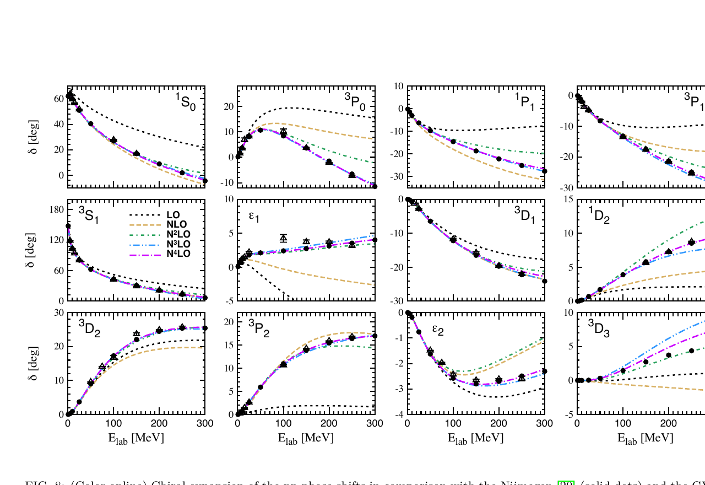

---
analysis_profile:
  category: measure
  field: "Nuclear physics"
  reason: "The forward interface supplies an interaction and scattering predictions, not a probability density. An observation model is separate; phase shifts themselves are not measures."
  note: "Approximate analysis-scale values; costs depend on the workload and implementation."
  metrics:
    forward_model_core_hours: 1
    parameter_count: 100
    analysis_core_hours: 1000
    data_input_mb: 100
    external_frameworks: 2
    software_stack_lines: 10000
    citation_count: 100
---

# Chiral EFT · Two-nucleon interactions

Record the interaction, regulator and low-energy constants that connect nuclear theory to scattering observables.

!!! info "Reproduction status"

    **Scoped**. Independent validation pending. Status updated 2026-07-17.

## Scientific model

This case concerns an integral-equation solve: $np$ phase shifts at N$^4$LO+ from published low-energy constants versus partial-wave-analysis points, with a truncation band.

The reproduction objective below defines the current scope; a complete published-analysis reproduction is not asserted.

## Model ingredients

Reusing this model requires the ingredients below. Availability and limitations
are described in the reproduction evidence.

- EFT order
- regulator form and cutoff
- operator basis
- low-energy constants and covariance
- fitted datasets and truncation-uncertainty prescription
- executable code or matrix-element tables and benchmark observables.

## Reproduction objective and evidence

**Objective:** $np$ phase shifts at N$^4$LO+ from published low-energy constants versus partial-wave-analysis points, with a truncation band

**Scope and limitations:** A canonical executable implementation or tabulated matrix elements are still needed.

## Figures

*Reference figure from the publication cited below.*

## Publications

- **Reinert:2017usi** (2018) · [DOI: 10.1140/epja/i2018-12516-4](https://doi.org/10.1140/epja/i2018-12516-4) · [arXiv:1711.08821](https://arxiv.org/abs/1711.08821)
- **Reinert:2020mcu** (2021) · [DOI: 10.1103/PhysRevLett.126.092501](https://doi.org/10.1103/PhysRevLett.126.092501) · [arXiv:2006.15360](https://arxiv.org/abs/2006.15360)

[Back to model gallery](../index.md)
